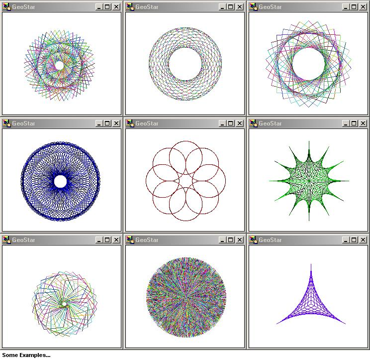

<div align="center">

## GeoStar


</div>

### Description

Create beauiful geometric stars with Geostar. Experiment with colour, size and shape to create your own works of art!
 
### More Info
 


<span>             |<span>
---                |---
**Submitted On**   |2001-09-26 17:28:18
**By**             |[Chris O'Hara](https://github.com/Planet-Source-Code/PSCIndex/blob/master/ByAuthor/chris-o-hara.md)
**Level**          |Advanced
**User Rating**    |3.7 (26 globes from 7 users)
**Compatibility**  |VB 5\.0, VB 6\.0
**Category**       |[Complete Applications](https://github.com/Planet-Source-Code/PSCIndex/blob/master/ByCategory/complete-applications__1-27.md)
**World**          |[Visual Basic](https://github.com/Planet-Source-Code/PSCIndex/blob/master/ByWorld/visual-basic.md)
**Archive File**   |[GeoStar269759262001\.zip](https://github.com/Planet-Source-Code/chris-o-hara-geostar__1-27548/archive/master.zip)

### API Declarations

```
Absolutely nothing
(Please vote for me I'm only 14)
```


